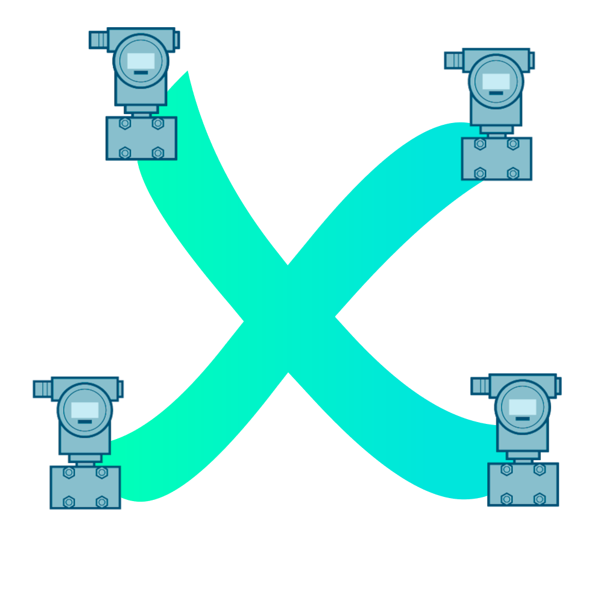

  
  Field Level Cross Communication

This project was conducted under the supervision of Siemens as part of our studies at Télécom Physique Strasbourg. It aims to implement lightweight IP communication for field devices. It includes the creation of a network protocol (xcom), firmware for field devices (xcom-fw), and a monitoring tool (monitoring-app).
To learn more about the project, check the following documents :
- [Poster.pdf](Poster.pdf)
- [Report.pdf](Report.pdf)
- [Review.pdf](Review.pdf)
